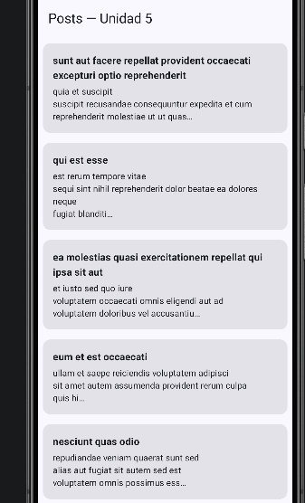
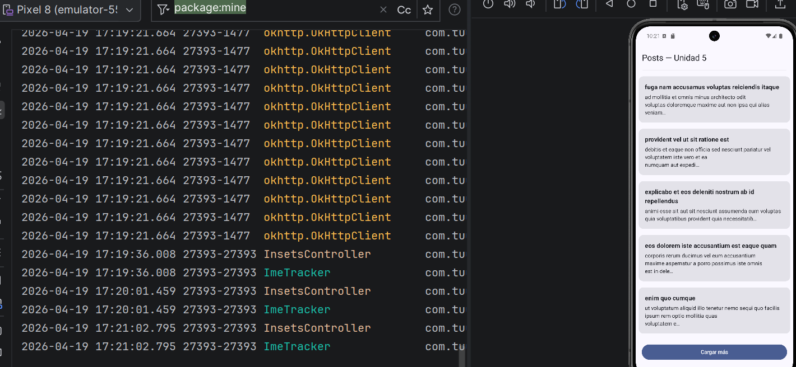
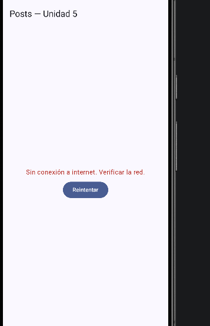

# Aplicaciones Móviles - Unidad 5

## Autor

- **Nombre:** Jhoseth Esneider Rozo Carrillo
- **Código:** 02230131027
- **Programa:** Ingeniería de Sistemas
- **Unidad:** 5 Consumo de Servicios y Comunicación con Backend
- **Actividad:** Post-Contenido 1
- **Fecha:** 19/04/2026

## Descripción del Proyecto

Este proyecto consiste en el desarrollo de una aplicación Android que consume una API REST utilizando Retrofit y OkHttp. La aplicación obtiene datos desde el servicio público JSONPlaceholder y los muestra en una lista utilizando Jetpack Compose.

Se implementa una arquitectura basada en MVVM, manejo de estados de interfaz, paginación simulada y control de errores de red mediante sealed classes.

---

## Tecnologías Utilizadas

- Kotlin
- Android Studio
- Jetpack Compose
- Retrofit
- OkHttp
- Kotlinx Serialization
- Coroutines
- StateFlow
- MVVM

---

## Configuración del Proyecto

### Requisitos

- Android Studio Hedgehog o superior
- JDK 17
- Emulador Android API 26+ o dispositivo físico
- Git configurado
- Conexión a internet

---

## Dependencias Principales

Agregar en app/build.gradle.kts:

implementation("com.squareup.retrofit2:retrofit:2.9.0")
implementation("com.jakewharton.retrofit:retrofit2-kotlinxserialization-converter:1.0.0")
implementation("org.jetbrains.kotlinx:kotlinx-serialization-json:1.6.2")

implementation("com.squareup.okhttp3:okhttp:4.12.0")
implementation("com.squareup.okhttp3:logging-interceptor:4.12.0")

implementation("org.jetbrains.kotlinx:kotlinx-coroutines-android:1.7.3")

implementation("androidx.lifecycle:lifecycle-viewmodel-compose:2.7.0")
implementation("androidx.lifecycle:lifecycle-runtime-compose:2.7.0")

Agregar plugin:

kotlin("plugin.serialization") version "1.9.22"

Permiso en AndroidManifest.xml:
<uses-permission android:name="android.permission.INTERNET"/> ```
API Utilizada

https://jsonplaceholder.typicode.com

---

## Estructura del Proyecto

- com.lab.retrofitlab
- │
- ├── data
- │ ├── remote
- │ │ ├── api
- │ │ └── dto
- │ └── repository
- │
- ├── domain
- │ ├── model
- │ └── error
- │
- ├── presentation
- │ ├── ui
- │ └── viewmodel
- │
- └── di

---

## Funcionalidades Implementadas

Consumo de API REST con Retrofit
Interceptor de logging para ver requests en Logcat
Interceptor para headers personalizados
Serialización JSON con kotlinx.serialization
Conversión de DTO a modelo de dominio
Manejo de errores con sealed class
Estados de UI:
Loading
Success
Error
Empty
Paginación simulada
Botón "Cargar más"

---

## Manejo de Errores

Se implementa una sealed class AppError para manejar:

Error de red (sin conexión)
Error 401/403 (no autorizado)
Error 404 (no encontrado)
Error del servidor (500+)
Error desconocido

Los errores se convierten en mensajes amigables para la interfaz.

Ejecución del Proyecto
Abrir el proyecto en Android Studio
Sincronizar Gradle
Ejecutar la aplicación en un emulador o dispositivo
Ver la lista de posts al iniciar

## Verificación del Funcionamiento

- Checkpoint 1

La aplicación inicia correctamente y muestra la lista de posts.

En Logcat se observan las peticiones HTTP con sus respuestas.

- Checkpoint 2

Al presionar el botón "Cargar más":

Se cargan nuevos posts
Se agregan al final de la lista
No se reemplazan los anteriores
En Logcat se observa \_page=2
Checkpoint 3

Al desactivar la conexión a internet:

Se muestra mensaje de error de red
Aparece botón "Reintentar"

Al reactivar la conexión:

La app vuelve a cargar correctamente

---

## Capturas del Proyecto

Las siguientes capturas se encuentran en la carpeta `/evidencias/`:

## App Compilando sin errores



## Obtener post al presionar "Cargar mas"



## Error al deshabilitar red y presionar "Reintentar"


